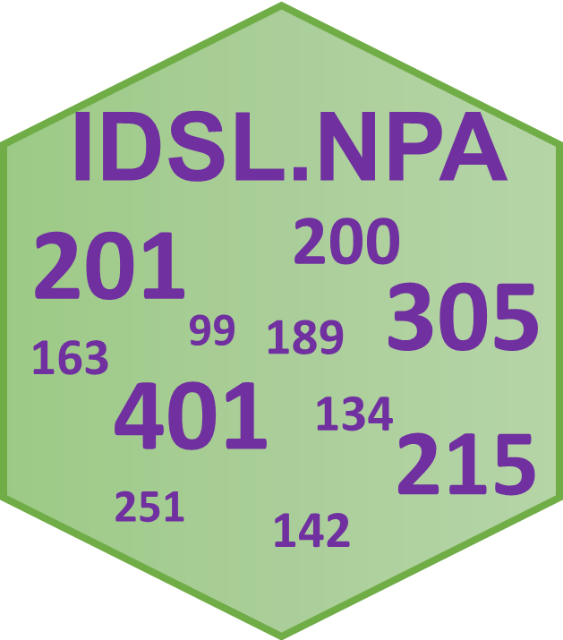

# IDSL.NPA

<!-- badges: start -->
[](https://github.com/sajfb)
[](https://cran.r-project.org/package=IDSL.NPA)


[](https://cran.r-project.org/package=IDSL.NPA)
<!-- badges: end -->

**Nominal Peak Analysis (NPA)** by the [**Integrated Data Science Laboratory for Metabolomics and Exposomics (IDSL.ME)**](https://www.idsl.me/) is an R package to facilitate processing of nominal mass spectrometry data. IDSL.NPA encapsulates a peak deconvolution workflow that was inspired by the approach taken by IDSL.CSA, while IDSL.NPA is exclusively capable of processing nominal mass data. Notably, IDSL.NPA does not require MS1 pre-processing to identify MS1 peaks. Additionally, IDSL.NPA is able to create and annotate *.msp* files which can be employed for subsequent untargeted MS/MS analysis.

## Table of Contents

- [Features of IDSL.NPA](https://github.com/idslme/IDSL.NPA#features-of-idslnpa)
- [Installation](https://github.com/idslme/IDSL.NPA#installation)
- [Workflow](https://github.com/idslme/IDSL.NPA#workflow)
- [Batch Example](https://github.com/idslme/IDSL.NPA#batch-example)
- [Citation](https://github.com/idslme/IDSL.NPA#citation)

## Features of IDSL.NPA

1) Parameter selection through a user-friendly and well-described [parameter spreadsheet](https://raw.githubusercontent.com/idslme/IDSL.NPA/main/NPA_parameters.xlsx)
2) Analyzing population size untargeted studies (n > 500)
3) Generating batch untargeted aligned extracted ion chromatograms (EIC) figures.
4) Parallel processing in Windows and Linux environments
5) Integration with [IDSL.FSA](https://github.com/idslme/IDSL.FSA) workflow to annotate various types of MSP files and generating fragmentation libraries using nominal mass values.

## Installation

	install.packages("IDSL.NPA")
	
**Note:** In case you want to process **netCDF/CDF** mass spectrometry data, you should also install the [**RnetCDF**](https://CRAN.R-project.org/package=RNetCDF) package separately using the below command.

	install.packages("RNetCDF")
	
## Workflow
You should download the [IDSL.NPA parameter spreadsheet](https://raw.githubusercontent.com/idslme/IDSL.NPA/main/NPA_parameters.xlsx) and select the parameters accordingly and then use this spreadsheet as the input for the IDSL.NPA workflow:	

	library(IDSL.NPA)
	IDSL.NPA_workflow("Address of the NPA parameter spreadsheet")

## Batch Example

Follow these steps for a case study (n=300) [ST001154](https://www.metabolomicsworkbench.org/data/DRCCStudySummary.php?Mode=SetupRawDataDownload&StudyID=ST001154) which has Agilent 6890N data collected in EI positive mode.

1. Transfer mass spectrometry data with ***.cdf*** extension in a separate folder

2. The **Nominal Mass Analysis** requires 24 parameters distributed into 4 separate sections for a full scale analysis. For this study, use default parameter values presented in the [NPA parameter spreadsheet](https://raw.githubusercontent.com/idslme/IDSL.NPA/main/NPA_parameters.xlsx). Next, provide information for 
	
	2.1. Select **YES** for **PARAM0001** in the `Start` tab to only process **NPA** workflow.
	
	2.2. **NPA0004** for *Input data location (MS data)*
	
	2.3. **NPA0008** for *Output location (.msp files and EICs)*
	
	2.4. You may also increase the number of processing threads using **NPA0003** according to your computational power

3. Run this command in R/Rstudio console or terminal:

```
library(IDSL.NPA)
IDSL.NPA_workflow("Address of the NPA parameter spreadsheet")
```

4. You may parse the results at the address you provided for **NPA0008**.

## [**Wiki**](https://github.com/idslme/IDSL.NPA/wiki)

1. [**IDSL.NPA example**](https://github.com/idslme/IDSL.NPA/wiki/NPA-for-hydroxylamine)

## Citation

[1] Fakouri Baygi, S., Kumar, Y. Barupal, D.K. [IDSL.CSA: Composite Spectra Analysis for Chemical Annotation of Untargeted Metabolomics Datasets](https://doi.org/10.1101/2023.02.09.527886). *bioRxiv*, **2023**.